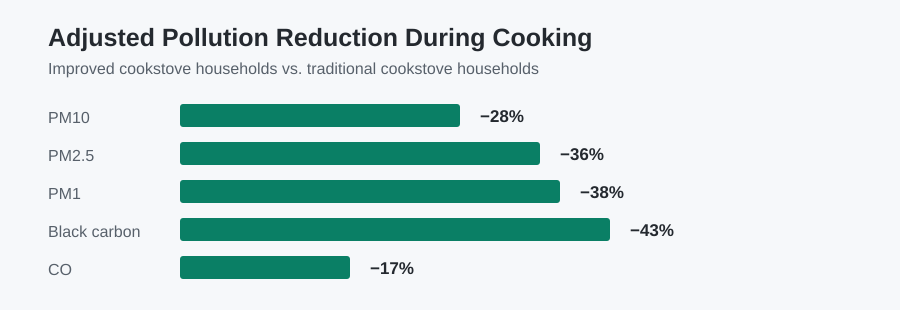
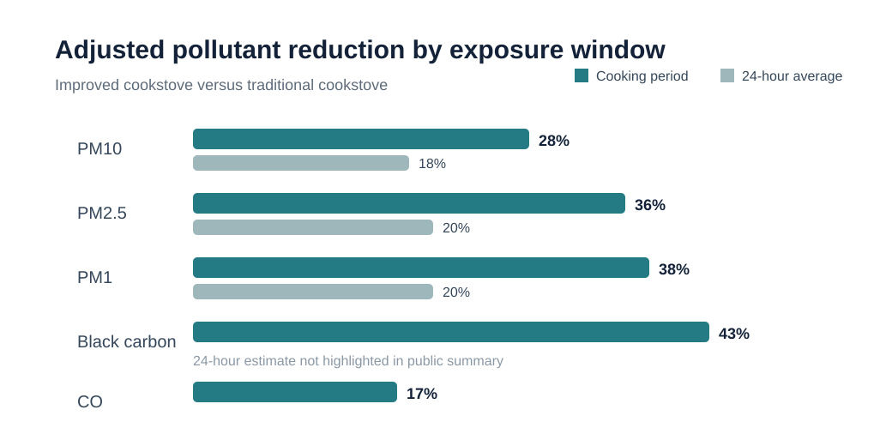
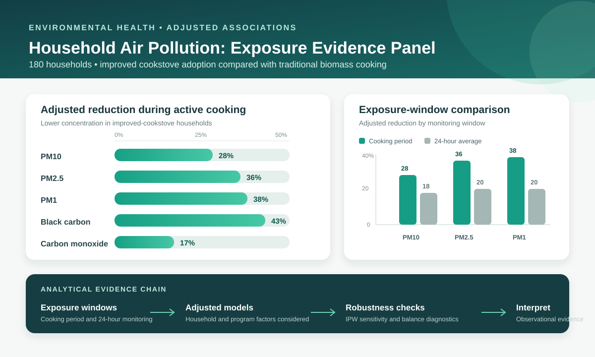
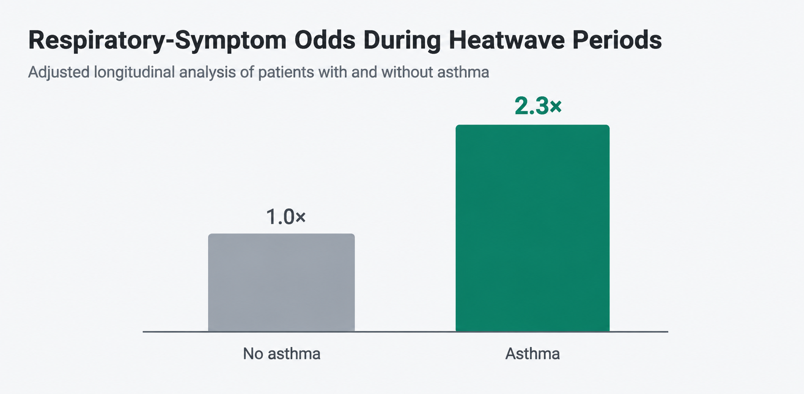
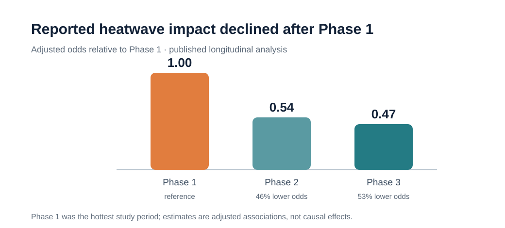
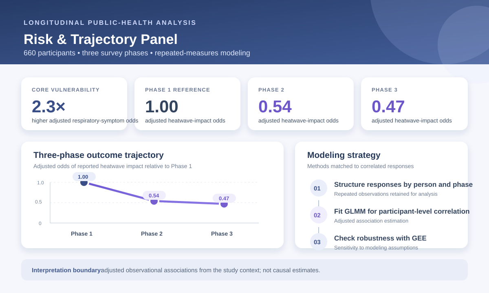
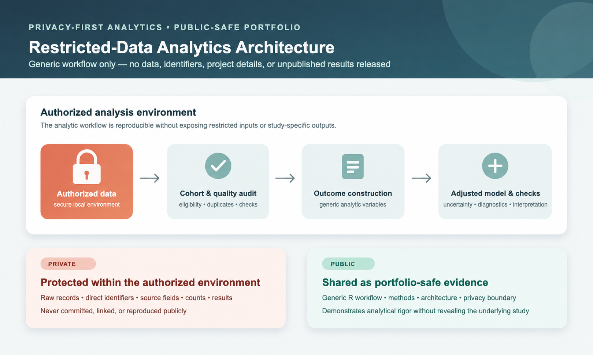
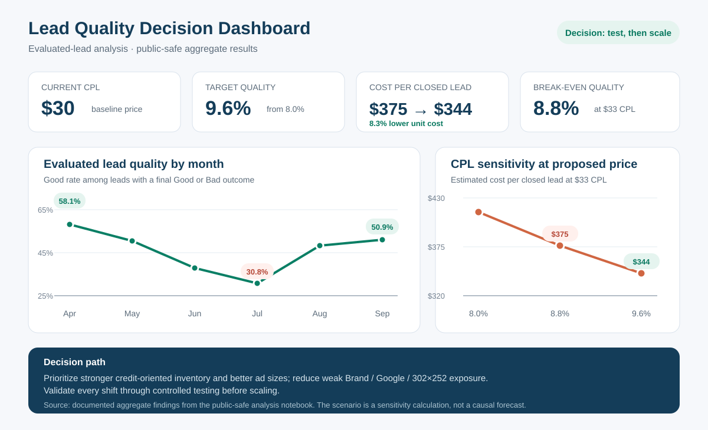
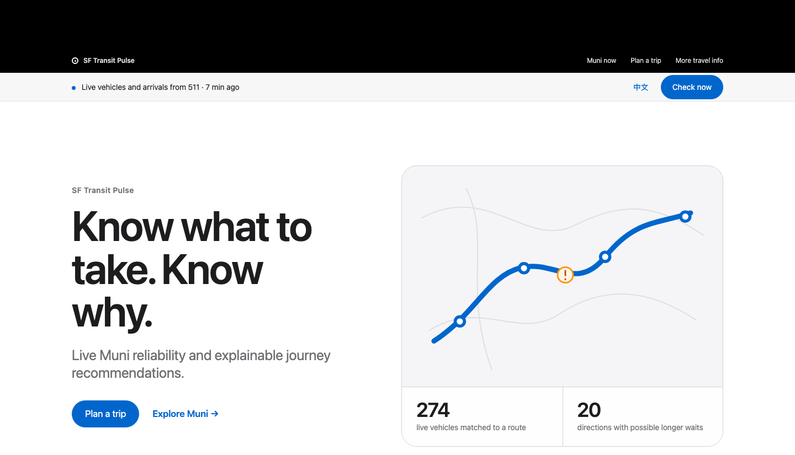

# Ka Wai Sit

### Data Analyst · Statistical & Business Analytics

**Official Analytics Portfolio** · This is the portfolio linked on my resume.

**SQL · Python · R · Statistical Modeling**

M.S. Biostatistics, UC San Diego &nbsp;|&nbsp; B.S. Statistics, UC Davis

[LinkedIn](https://www.linkedin.com/in/ka-wai-sit-723267212/) · [Resume](assets/KaWaiSit_Analytics_Resume_Public.pdf) · [Featured Projects](#featured-analytics-projects) · [Email](mailto:kawaisit14@gmail.com)

**Question → Clean & Validate → Analyze → Model → Visualize → Recommend**

---

## About Me

Data Analyst with experience across gaming analytics and public-health research. I use SQL, Python, R, and statistical modeling to work through complex datasets, identify actionable patterns, and support business and research decisions.

My work combines the practical discipline of analytics—defining a decision, validating messy data, and communicating a recommendation—with rigorous applied statistics. I am especially interested in roles where data can guide operational, policy, or research decisions.

## Professional Snapshot

- **UC San Diego — Research Data Analyst:** Led statistical analysis across public-health research involving environmental exposure, clinical screening, and longitudinal health data.
- **Galaxy Entertainment — TG Analysis Analyst:** Analyzed millions of gaming transactions with SQL and R for customer segmentation, revenue KPI reporting, workforce planning, pricing, and revenue analysis.
- **Research:** Contributed to published and submitted research and presented two projects at the ACE Annual Meeting.

## Featured Analytics Projects

### 01 — [Household Air Pollution Analysis](https://github.com/ksitcode00/household-air-pollution-analysis)

**Context:** UC San Diego environmental-health research | 180 households

**Research question:** Were improved-cookstove households associated with lower indoor air pollution after accounting for household and program factors?

**Finding:** In adjusted models, improved-cookstove use was associated with **28% lower PM10**, **36% lower PM2.5**, and **38% lower PM1** during cooking periods.

**Program implication:** Cleaner-stove programs may have their clearest benefit during active cooking, while electricity access, kitchen setting, and household conditions still shape real-world exposure.

**My role:** Led statistical analysis in R, including data cleaning, adjusted regression models, causal-inference sensitivity analysis, diagnostics, and interpretation for manuscript development.

`R` · `Regression Modeling` · `Environmental Health` · `Mediation` · `Causal-Inference Sensitivity Analysis`

[Project Overview](https://github.com/ksitcode00/household-air-pollution-analysis) · [R Analysis](https://github.com/ksitcode00/household-air-pollution-analysis/blob/main/analysis/air_pollution_analysis.Rmd) · [Methods](https://github.com/ksitcode00/household-air-pollution-analysis/blob/main/docs/methodology.md) · [Data Privacy](https://github.com/ksitcode00/household-air-pollution-analysis/blob/main/docs/data_privacy.md)

**Exposure-window comparison**

**Exposure evidence panel**

---

### 02 — [Longitudinal Health Analysis](https://github.com/ksitcode00/longitudinal-health-analysis)

**Context:** UC San Diego longitudinal public-health research | 660 participants

**Research question:** How did self-reported health impacts and symptoms change across three survey phases, and which groups appeared most vulnerable?

**Finding:** Patients with asthma had approximately **2.3× higher odds of respiratory symptoms** during heatwave periods; reported impacts generally declined across later study phases.

**Risk implication:** Free-text symptom cleaning, repeated-measures modeling, and targeted risk communication can help identify groups that may benefit from symptom surveillance and support.

**My role:** Conducted longitudinal statistical analysis in R, including symptom-data cleaning, repeated-measures restructuring, GEE and mixed-effects modeling, diagnostics, and interpretation.

`R` · `GEE` · `GLMM` · `Longitudinal Analysis` · `Health-Survey Data`

[Project Overview](https://github.com/ksitcode00/longitudinal-health-analysis) · [R Analysis](https://github.com/ksitcode00/longitudinal-health-analysis/blob/main/analysis/longitudinal_health_analysis.Rmd) · [Figures](https://github.com/ksitcode00/longitudinal-health-analysis/tree/main/figures) · [Methods](https://github.com/ksitcode00/longitudinal-health-analysis/blob/main/docs/methodology.md) · [Data Privacy](https://github.com/ksitcode00/longitudinal-health-analysis/blob/main/docs/data_privacy.md)

**Adjusted phase associations**

**Longitudinal risk & trajectory panel**

---

### 03 — [Privacy-Safe Clinical Screening Analytics](https://github.com/ksitcode00/privacy-safe-clinical-screening-analysis)

**Context:** Anonymized restricted-data analytics project

**Research question:** How can a clinical-screening workflow be analyzed rigorously while protecting all project-identifying information and restricted data?

**What it demonstrates:** Cohort auditing, generic screening/history outcome construction, exact confidence intervals, adjusted logistic regression, and privacy-aware documentation.

**My role:** Built the R workflow for data-quality auditing, outcome construction, descriptive uncertainty estimation, adjusted modeling, diagnostic checks, and clear analytical reporting.

`R` · `Clinical Screening` · `Logistic Regression` · `Data Quality` · `Privacy-Aware Analytics`

[Project Overview](https://github.com/ksitcode00/privacy-safe-clinical-screening-analysis) · [R Pipeline](https://github.com/ksitcode00/privacy-safe-clinical-screening-analysis/tree/main/R) · [Methods](https://github.com/ksitcode00/privacy-safe-clinical-screening-analysis/blob/main/docs/methodology.md) · [Data Privacy](https://github.com/ksitcode00/privacy-safe-clinical-screening-analysis/blob/main/docs/data_privacy.md)

---

### 04 — [Lead Quality Optimization](https://github.com/ksitcode00/lead-quality-optimization)

**Context:** Interview-style marketing analytics challenge

**Business problem:** Could a marketing team raise cost per lead from **$30 to $33** if lead quality improves from **8.0% to 9.6%**?

**Finding:** Using the supplied 8.0% to 9.6% quality scenario and $30 to $33 CPL amounts, cost per qualifying lead falls from **$375 to $343.75**. Closed conversions are examined separately as a business outcome.

**Recommendation:** Agree on the payment quality definition, track closed conversions alongside it, test shifts from weaker segments, and validate changes through controlled rollout.

**My role:** Completed the end-to-end Python analysis, including data validation, trend and segment analysis, adjusted logistic regression, scenario modeling, and executive recommendations.

`Python` · `pandas` · `Logistic Regression` · `KPI Analysis` · `Scenario Analysis`

[Project README](https://github.com/ksitcode00/lead-quality-optimization) · [Analysis Notebook](https://github.com/ksitcode00/lead-quality-optimization/blob/main/notebooks/lead_quality_analysis.ipynb) · [Key Figures](https://github.com/ksitcode00/lead-quality-optimization/tree/main/figures) · [Methodology](https://github.com/ksitcode00/lead-quality-optimization/blob/main/docs/methodology.md)

**Completed:** 2026. The project documentation includes setup instructions, analytical decisions, limitations, and a [validation record](https://github.com/ksitcode00/lead-quality-optimization/blob/main/docs/validation.md).

---

### 05 — [SF Transit Pulse](https://github.com/ksitcode00/sf-transit-pulse-site)

**Context:** Independent public-transit decision-support product | Auto-updating bilingual web application

**Product problem:** Most transit tools show an arrival time, but riders may still need to know whether vehicles are bunching, whether one direction has a longer gap, whether a transfer is realistic, and why one trip ranks above another.

**What I built:** A public Muni decision system that combines live vehicle positions, trip predictions, service notices, road context, route-direction diagnostics, direct and one-transfer planning, and explainable Fastest, Balanced, and Historical Context rankings.

**Engineering outcome:** The serverless pipeline refreshes core transit data about every three minutes, monitors freshness independently, recovers stale snapshots, and clearly distinguishes current, retained, delayed, and unavailable sources instead of presenting old data as realtime.

**My role:** Designed and built the end-to-end product in Python and JavaScript, including 511 and DataSF ingestion, GTFS-Realtime processing, geospatial matching, headway and bunching analysis, multi-objective trip scoring, bilingual responsive UI, automated testing, monitoring, and GitHub Pages deployment.

`Python` · `JavaScript` · `GTFS-Realtime` · `Geospatial Analytics` · `Decision Support` · `Data Pipelines`

[Live App](https://ksitcode00.github.io/sf-transit-pulse-site/?lang=en) · [Project Overview](https://github.com/ksitcode00/sf-transit-pulse-site) · [Recommendation Method](https://github.com/ksitcode00/sf-transit-pulse-site#how-recommendations-are-calculated) · [Serverless Architecture](https://github.com/ksitcode00/sf-transit-pulse-site#serverless-architecture) · [Tests](https://github.com/ksitcode00/sf-transit-pulse-site#tests)

## Selected Research & Publications

- **Heat and Dust Impacts on the Health of Refugees in Zaatari Refugee Camp** — Co-author · *GeoHealth* (2026) · [Paper](https://pubmed.ncbi.nlm.nih.gov/42524033/) · [DOI](https://doi.org/10.1029/2025GH001687)
- **Determinants of Concentrations of Indoor Pollutants in Homes in Rural India** — Co-author · submitted to *Indoor Air*
- **Household Air Pollution by Cookstove Type and Home Characteristics** — Co-author · manuscript in preparation · statistical analysis completed
- **Confidential Clinical Research** — Co-author · submitted manuscript
- **Impacts of Improved Cookstoves on Indoor Pollution and Respiratory Illnesses** — Poster presenter · ACE Annual Meeting (2025)
- **Confidential Clinical Research** — Poster presenter · ACE Annual Meeting (2025)

## Additional Technical Work

- [Statistical Learning: Classification & Model Selection](https://github.com/ksitcode00/statistical-learning-classification) — R implementations of logistic regression, LDA, SVM, trees, random forests, and cross-validation.

## Technical Skills

| Area | Tools & methods |
| --- | --- |
| **Programming & analytics** | SQL, Python, R, Excel, `pandas`, tidyverse, data cleaning, EDA, reporting |
| **Statistical analysis** | Regression, logistic regression, longitudinal analysis, GEE, mixed-effects models, causal-inference sensitivity analysis, A/B testing |
| **Decision support** | KPI analysis, segmentation, scenario analysis, data visualization, research communication |

Open to Data Analyst and Research Analyst opportunities.

 

[LinkedIn](https://www.linkedin.com/in/ka-wai-sit-723267212/) · [Resume](assets/KaWaiSit_Analytics_Resume_Public.pdf) · [Email](mailto:kawaisit14@gmail.com)

